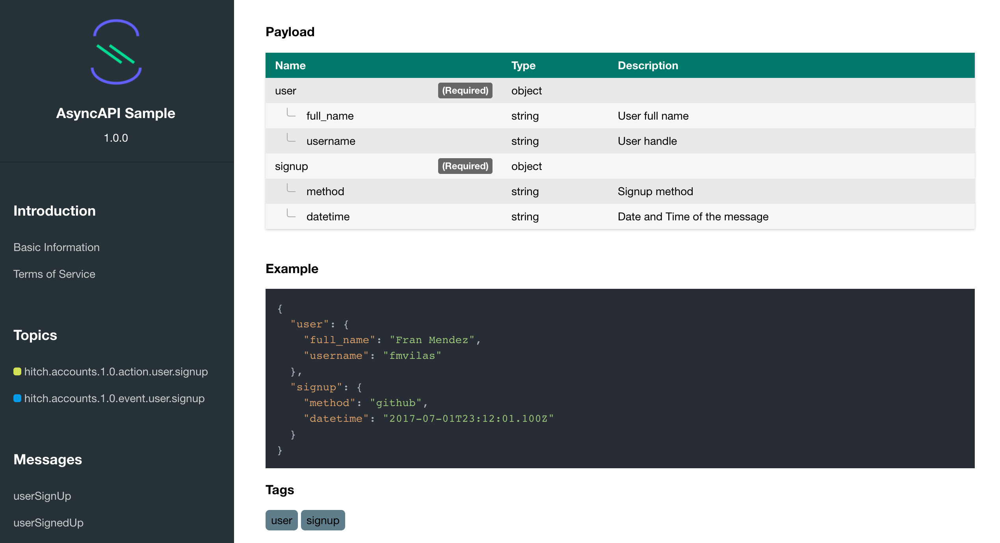

<p align="center"></p>
<p align="center">
  <strong>AsyncAPI Documentation Generator</strong>
</p>
<p align="center">
  <em>Use your AsyncAPI definition to generate beautiful<br>human-readable documentation for your API.</em>
</p>
<br><br>



## Install

To use it from the CLI:

```bash
npm install -g asyncapi-docgen
```

To use it as a module in your project:

```bash
npm install --save asyncapi-docgen
```

## Usage

### From the command-line interface (CLI)

```bash
  Usage: adg [options] <asyncAPI>


  Options:

    -V, --version             output the version number
    -o, --output <outputDir>  directory where to put the generated files (defaults to current directory)
    -h, --help                output usage information
```

#### Examples

The shortest possible syntax:
```bash
adg asyncapi.yaml
```

Specify where to put the generated documentation:
```bash
adg asyncapi.yaml -o ./docs
```

### As a module in your project

```js
const docs = require('asyncapi-docgen');
const asyncapi = YAML.load('./asyncapi.yaml');

docs
  .generateFullHTML(asyncapi)
  .then((html) => {
    console.log('Done!');
    console.log(html);
  })
  .catch(err => {
    console.error(`Something went wrong: ${err.message}`);
  });
```

#### Using async/await

The function `docgen.generateFullHTML` returns a Promise, so it means you can use async/await:

```js
const docs = require('asyncapi-docgen');
const asyncapi = YAML.load('./asyncapi.yaml');

try {
  const html = await docs.generateFullHTML(asyncapi);
  console.log('Done!');
  console.log(html);
} catch (e) {
  console.error(`Something went wrong: ${e.message}`);
}
```

## Custom specification extensions

This package makes use of two different custom specification extensions:

|Extension|Path|Description|
|---------|----|-----------|
|`x-logo`|`/info`|URL of the logo rendered on the top left corner of the documentation.|
|`x-topic-separator`|`/`|A string to use as the topic separator.|

#### Examples

Custom logo:

```yaml
asyncapi: '1.0.0'
info:
  title: My API
  x-logo: https://your-company.com/logo.png
```

MQTT-style topic separator:

```yaml
asyncapi: '1.0.0'
x-topic-separator: '/' # This will replace dots with slashes in topic names
```

## Requirements

* Node.js v7.6+

## Author

Fran Méndez ([@fmvilas](http://twitter.com/fmvilas))
